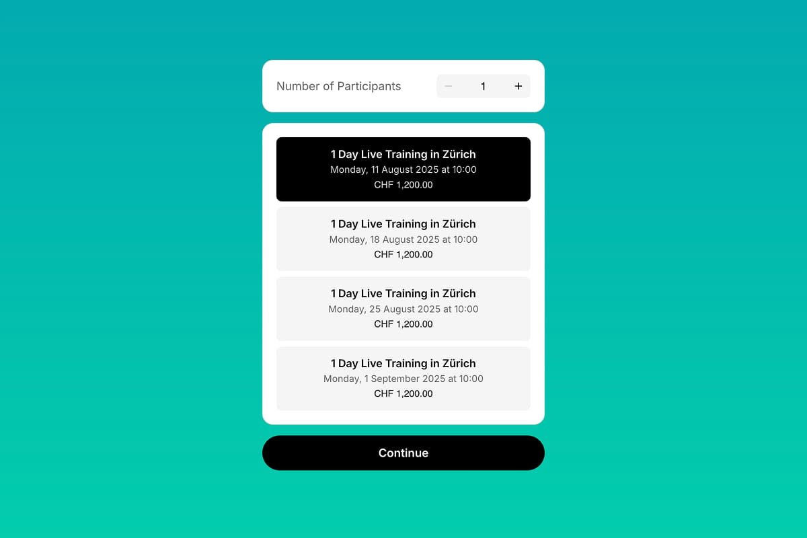

# Booking Widget - Group Day Events

Online booking widget for group services using Bookla API. This component shows one event per day and allows users to select number of spots and event date, then fill out a booking form. It supports guest mode, custom form fields, and terms and conditions.
Use this component if you have one event per day and a few events per 1-3 months. You can configure the time period for which events are loaded.

## Preview

## Installation

### 1. Copy the component files

- **Component:** [`component.tsx`](./component.tsx)

### 2. Add to your Framer project
- Open your Framer project
- Create a new Component named `GroupEventWidget.tsx`
- Paste the copied code into `GroupEventWidget.tsx`
- Drag the `GroupEventWidget` component onto your canvas

### 3. Connect with Bookla API
- Sign up at [Bookla.com](https://bookla.com) to get your API key and company ID
- Create a new service in Bookla with the type "Group"
- Add schedule slots for this service
- In the Framer properties panel, set your:
  - `bookla.region` to either `'us'` or `'eu'` based on platform location.
  - `bookla.apiKey` and `bookla.companyID` to connect the component with your Bookla account
- Set the `serviceID` to the ID of the "group" service you want to book
- This tutorial on Youtube can help you with the setup: [How to Add Booking Component in Framer](https://www.youtube.com/watch?v=GRAvVYIU7_U)

## Properties

This component provides extensive customization options through Framer's property controls. All properties are optional unless marked as required.

### Core Configuration

| Property | Type | Default | Description |
|----------|------|---------|-------------|
| `size` | `Enum` | `'md'` | Component size: Small, Medium, or Large |
| `backgroundColor` | `Color` | `'white'` | Main background color |
| `primaryColor` | `Color` | `'black'` | Primary text and accent color |
| `secondaryColor` | `Color` | `'#666'` | Secondary text color |
| `fontFamily` | `String` | `'Inter'` | Font family for all text |
| `locale` | `String` | `'en-US'` | Locale for date/time formatting |
| `guestMode` | `Boolean` | `true` | Enable guest booking without authentication |

### Item Styling

| Property | Type | Default | Description |
|----------|------|---------|-------------|
| `item.bgColor` | `Color` | `'#f5f5f5'` | Background color for interactive items |
| `item.selectColor` | `Color` | `'black'` | Brand color for selected items |
| `item.borderRadius` | `BorderRadius` | `'8px'` | Border radius for interactive items |

### Button Styling

| Property | Type | Default | Description |
|----------|------|---------|-------------|
| `button.bgColor` | `Color` | `'black'` | Background color for action button |
| `button.textColor` | `Color` | `'white'` | Text color for action button |
| `button.borderRadius` | `BorderRadius` | `'32px'` | Border radius for action button |

### Block Layout

| Property | Type | Default | Description |
|----------|------|---------|-------------|
| `blocks.gap` | `Number` | `8` | Spacing between component blocks |
| `blocks.padding` | `Padding` | `'20px'` | Internal padding for component blocks |
| `blocks.borderRadius` | `BorderRadius` | `'16px'` | Border radius for component blocks |

### Date Range Configuration

| Property | Type | Default | Description |
|----------|------|---------|-------------|
| `dateRange.months` | `Number` | `2` | Number of months ahead to load events (1-12) |

### Participants Configuration

| Property | Type | Default | Description |
|----------|------|---------|-------------|
| `participants.min` | `Number` | `1` | Minimum number of participants |
| `participants.max` | `Number` | `10` | Maximum number of participants |

### Guest Mode Configuration

*Only visible when `guestMode` is enabled*

| Property | Type | Default | Description |
|----------|------|---------|-------------|
| `guestModeTexts.title` | `String` | `'Client\'s data'` | Guest form section title |
| `guestModeTexts.subtitle` | `String` | `'Please fill the form below'` | Guest form section subtitle |
| `guestModeTexts.firstName` | `String` | `'First Name'` | First name field label |
| `guestModeTexts.lastName` | `String` | `'Last Name'` | Last name field label |
| `guestModeTexts.email` | `String` | `'Email'` | Email field label |

### Custom Form Configuration

| Property | Type | Default | Description |
|----------|------|---------|-------------|
| `customForm.formTitle` | `String` | `'Additional data'` | Custom form section title |
| `customForm.formSubtitle` | `String` | `'Please enter fields below'` | Custom form section subtitle |
| `customForm.fields` | `Array` | `[]` | Array of custom form fields |

### Custom Form Field Properties

| Property | Type | Default | Description |
|----------|------|---------|-------------|
| `labelText` | `String` | `''` | Field label text |
| `type` | `Enum` | `'text'` | Field type: text, textarea, number, multiselect, select, phone, url |
| `options` | `String` | `''` | Comma-separated options for select/multiselect fields |
| `placeholderText` | `String` | `'Enter value'` | Field placeholder text |
| `inputWidth` | `Enum` | `'auto / span 2'` | Field width: Half or Full |
| `required` | `Boolean` | `true` | Whether field is required |
| `errorText` | `String` | `'This field is required'` | Error message for validation |

### Terms and Conditions

| Property | Type | Default | Description |
|----------|------|---------|-------------|
| `showTerms` | `Boolean` | `false` | Show terms acceptance checkbox |

### Terms Configuration

*Only visible when `showTerms` is enabled*

| Property | Type | Default | Description |
|----------|------|---------|-------------|
| `terms.text` | `String` | `'I agree to the'` | Text before the terms link |
| `terms.highlightedText` | `String` | `'Terms and Conditions'` | Clickable link text |
| `terms.termsLink` | `String` | `'https://example.com/terms'` | URL for terms page |

### Text Configuration

| Property | Type | Default | Description |
|----------|------|---------|-------------|
| `texts.noEvents` | `String` | `'No events available in the selected period'` | Message when no events found |
| `texts.continue` | `String` | `'Continue'` | Continue button text |
| `texts.makeBooking` | `String` | `'Book Event'` | Book event button text |
| `texts.loginToBook` | `String` | `'Please login to book'` | Login prompt button text |
| `texts.participantsText` | `String` | `'Number of Participants'` | Participants picker label |

### API Configuration

| Property | Type | Default | Description |
|----------|------|---------|-------------|
| `bkla.apiRegion` | `Enum` | `'us'` | API region: U.S. or Europe |
| `bkla.apiKey` | `String` | `''` | Bookla API key |
| `bkla.companyID` | `String` | `''` | Company ID from Bookla |
| `serviceID` | `String` | `''` | Service ID to load events from |

### Route Configuration

| Property | Type | Default | Description |
|----------|------|---------|-------------|
| `routes.confirmed` | `Link` | `'/'` | Route to navigate after successful booking |
| `routes.pending` | `Link` | `'/'` | Route to navigate for pending bookings |