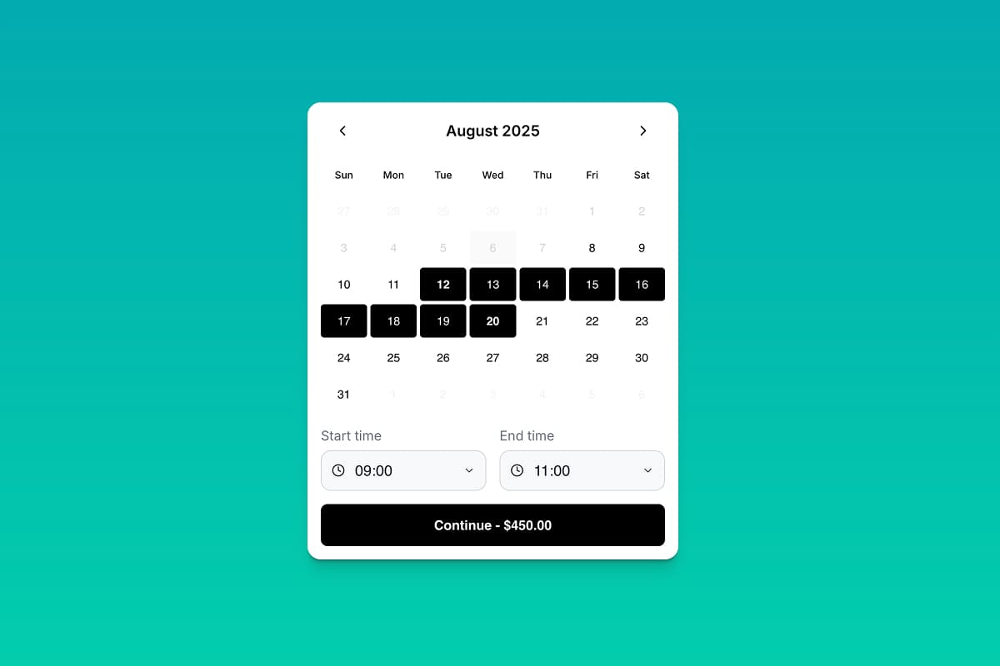

# Booking Widget - Rental Services

Online booking widget for services with flexible duration using Bookla API. This component allows users to select a date range, and time, then fill out a booking form. It supports guest mode and custom form fields.

## Preview

## Installation

### 1. Copy the component files

- **Component:** [`component.tsx`](./component.tsx)

### 2. Add to your Framer project
- Open your Framer project
- Create a new Component named `RentalWidget.tsx`
- Paste the copied code into `RentalWidget.tsx`
- Drag the `RentalWidget` component onto your canvas

### 3. Connect with Bookla API
- Sign up at [Bookla.com](https://bookla.com) to get your API key and company ID
- In the Framer properties panel, set your:
  - `bookla.region` to either `'us'` or `'eu'` based on platform location.
  - `bookla.apiKey` and `bookla.companyID` to connect the component with your Bookla account
- Set the `serviceID` to the ID of the "flexible" service you want to book

## Properties

This component provides extensive customization options for date range booking functionality. All properties are optional unless marked as required.

### Basic Configuration

| Property | Type | Default | Description |
|----------|------|---------|-------------|
| `size` | `'sm' \| 'md' \| 'lg'` | `'md'` | Component size variant |
| `fontFamily` | `String` | `'Inter'` | Font family for text elements |
| `locale` | `String` | `'en-US'` | Locale for date/time formatting |
| `guestMode` | `Boolean` | `true` | Allow booking without user login |

### Color Scheme

| Property | Type | Default | Description |
|----------|------|---------|-------------|
| `primaryColor` | `Color` | `'#000000'` | Primary text and border color |
| `secondaryColor` | `Color` | `'#666666'` | Secondary text color |
| `backgroundColor` | `Color` | `'#ffffff'` | Background color of the component |
| `accentColor` | `Color` | `'#3b82f6'` | Accent color for highlights |
| `selectedColor` | `Color` | `'#10b981'` | Color for selected date ranges |
| `disabledColor` | `Color` | `'#d1d5db'` | Color for disabled/unavailable dates |
| `buttonBg` | `Color` | `'#10b981'` | Button background color |
| `buttonText` | `Color` | `'#ffffff'` | Button text color |

### Layout & Spacing

| Property | Type | Default | Description |
|----------|------|---------|-------------|
| `borderRadius` | `Number` | `8` | Border radius for UI elements (px) |
| `padding` | `Number` | `20` | Internal padding of the component (px) |
| `gap` | `Number` | `16` | Gap between UI elements (px) |

### Bookla API Configuration

| Property | Type | Default | Required | Description |
|----------|------|---------|----------|-------------|
| `bkla.apiKey` | `String` | `''` | ✅ | Your Bookla API key |
| `bkla.companyID` | `String` | `''` | ✅ | Your Bookla company ID |
| `bkla.apiRegion` | `'us' \| 'eu'` | `'us'` | - | API region (U.S. or Europe) |
| `serviceID` | `String` | `''` | ✅ | Service ID to book |

### Guest Mode Configuration

*Only visible when `guestMode` is enabled*

| Property | Type | Default | Description |
|----------|------|---------|-------------|
| `guestModeTexts.title` | `String` | `'Client\'s data'` | Guest form section title |
| `guestModeTexts.subtitle` | `String` | `'Please fill the form below'` | Guest form section subtitle |
| `guestModeTexts.firstName` | `String` | `'First Name'` | First name field label |
| `guestModeTexts.lastName` | `String` | `'Last Name'` | Last name field label |
| `guestModeTexts.email` | `String` | `'Email'` | Email field label |

### Custom Form Fields

Configure additional form fields for booking:

| Property | Type | Default | Description |
|----------|------|---------|-------------|
| `customForm.formTitle` | `String` | `'Additional data'` | Custom form section title |
| `customForm.formSubtitle` | `String` | `'Please enter fields below'` | Custom form section subtitle |
| `customForm.fields` | `Array` | `[]` | Array of custom form field objects |

### Custom Form Field Object

Each field in the `customForm.fields` array has these properties:

| Property | Type | Default | Description |
|----------|------|---------|-------------|
| `labelText` | `String` | `''` | Field label text |
| `type` | `'text' \| 'textarea' \| 'number' \| 'multiselect' \| 'select' \| 'phone' \| 'url'` | `'text'` | Input field type |
| `options` | `String` | `''` | Comma-separated options (for select/multiselect) |
| `placeholderText` | `String` | `'Enter value'` | Placeholder text |
| `inputWidth` | `'auto / span 1' \| 'auto / span 2'` | `'auto / span 2'` | Field width (Half or Full) |
| `required` | `Boolean` | `true` | Whether field is required |
| `errorText` | `String` | `'This field is required'` | Error message for validation |

### User Interface Text

Customize all user-facing text:

| Property | Type | Default | Description |
|----------|------|---------|-------------|
| `texts.continue` | `String` | `'Continue'` | Continue button text |
| `texts.makeBooking` | `String` | `'Make booking'` | Final booking button text |
| `texts.loginToBook` | `String` | `'Please login to book'` | Login required button text |
| `texts.datesUnavailable` | `String` | `'These dates are unavailable'` | Message for unavailable dates |

### Navigation Routes

Configure where users are redirected after booking:

| Property | Type | Default | Description |
|----------|------|---------|-------------|
| `routes.confirmed` | `Link` | `'/'` | Page to redirect to for confirmed bookings |
| `routes.pending` | `Link` | `'/'` | Page to redirect to for pending bookings |