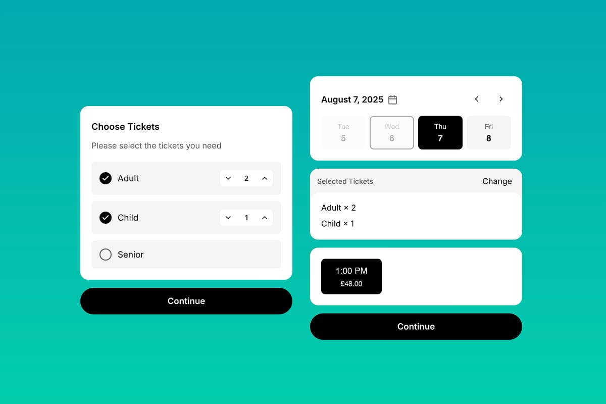

# Booking Widget - Ticket Services

Online booking widget for ticket-based services using Bookla API. Users can select a number of tickets, date, time, and resource, then fill out a booking form. The component supports guest mode, custom form fields, and terms and conditions.

## Preview

## Installation

### 1. Copy the component files

- **Component:** [`component.tsx`](./component.tsx)

### 2. Add to your Framer project
- Open your Framer project
- Create a new Component named `TicketWidget.tsx`
- Paste the copied code into `TicketWidget.tsx`
- Drag the `TicketWidget` component onto your canvas

### 3. Connect with Bookla API
- Sign up at [Bookla.com](https://bookla.com) to get your API key and company ID
- In the Framer properties panel, set your:
  - `bookla.region` to either `'us'` or `'eu'` based on platform location.
  - `bookla.apiKey` and `bookla.companyID` to connect the component with your Bookla account
- Set the `serviceID` to the ID of the "ticket" service you want to book

## Properties

This component provides extensive customization options through Framer's property controls. All properties are optional unless marked as required.

### Basic Configuration

| Property | Type | Default | Description |
|----------|------|---------|-------------|
| `size` | `'sm' \| 'md' \| 'lg'` | `'md'` | Component size variant |
| `backgroundColor` | `Color` | `'white'` | Background color of the component |
| `primaryColor` | `Color` | `'black'` | Primary brand color |
| `secondaryColor` | `Color` | `'#666'` | Secondary text color |
| `fontFamily` | `String` | `'Inter'` | Font family for text elements |
| `locale` | `String` | `'en-US'` | Locale for date/time formatting |
| `localTime` | `Boolean` | `true` | Use local timezone for time display |
| `guestMode` | `Boolean` | `true` | Allow booking without user login |

### Bookla API Configuration

| Property           | Type | Default | Required | Description |
|--------------------|------|---------|----------|-------------|
| `bookla.apiKey`    | `String` | `''` | ✅ | Your Bookla API key |
| `bookla.companyID` | `String` | `''` | ✅ | Your Bookla company ID |
| `bookla.apiRegion` | `'us' \| 'eu'` | `'us'` | - | API region (U.S. or Europe) |
| `serviceID`        | `String` | `''` | ✅ | Service ID to book |

### Pre-selection Options

| Property | Type | Default | Description |
|----------|------|---------|-------------|
| `selectedDate` | `Date` | - | Pre-select a specific date |
| `selectedResourceID` | `String` | `''` | Pre-select a specific resource |

### Item Styling

Customize the appearance of selectable items (dates, times, etc.):

| Property | Type | Default | Description |
|----------|------|---------|-------------|
| `item.bgColor` | `Color` | `'#f5f5f5'` | Background color of items |
| `item.selectColor` | `Color` | `'black'` | Brand color for selected items |
| `item.selectedTextColor` | `Color` | `'white'` | Text color on selected items |
| `item.selectedSecondaryTextColor` | `Color` | `'white'` | Secondary text color on selected items |
| `item.borderRadius` | `BorderRadius` | `'8px'` | Border radius for items |

### Button Styling

Customize the main action buttons:

| Property | Type | Default | Description |
|----------|------|---------|-------------|
| `button.bgColor` | `Color` | `'black'` | Button background color |
| `button.textColor` | `Color` | `'white'` | Button text color |
| `button.borderRadius` | `BorderRadius` | `'32px'` | Button border radius |

### Block Layout

Configure the layout and spacing of content blocks:

| Property | Type | Default | Description |
|----------|------|---------|-------------|
| `blocks.gap` | `Number` | `8` | Gap between blocks (px) |
| `blocks.padding` | `Padding` | `'20px'` | Internal padding of blocks |
| `blocks.border` | `Border` | `2px solid #F5F5F5` | Border styling for blocks |
| `blocks.borderRadius` | `BorderRadius` | `'16px'` | Border radius for blocks |

### Date Configuration

| Property | Type | Default | Description |
|----------|------|---------|-------------|
| `datesCount.min` | `Number` | `3` | Minimum number of dates to show |
| `datesCount.max` | `Number` | `7` | Maximum number of dates to show |

### Participants Configuration

Configure participant limits for the booking component:

| Property | Type | Default | Min | Description |
|----------|------|---------|-----|-------------|
| `participants.min` | `Number` | `1` | `1` | Minimum number of participants required |
| `participants.max` | `Number` | `10` | `1` | Maximum number of participants allowed |

### Resource Picker

Configure the resource selection functionality:

| Property | Type | Default | Description |
|----------|------|---------|-------------|
| `resourcePicker.visible` | `Boolean` | `false` | Show/hide resource selector |
| `resourcePicker.selectResourceText` | `String` | `'Select resource'` | Text for resource selection prompt |
| `resourcePicker.anyResourceText` | `String` | `'Any resource'` | Text for "any resource" option |

### Guest Mode Configuration

*Only visible when `guestMode` is enabled*

| Property | Type | Default | Description |
|----------|------|---------|-------------|
| `guestModeTexts.title` | `String` | `'Client\'s data'` | Guest form section title |
| `guestModeTexts.subtitle` | `String` | `'Please fill the form below'` | Guest form section subtitle |
| `guestModeTexts.firstName` | `String` | `'First Name'` | First name field label |
| `guestModeTexts.lastName` | `String` | `'Last Name'` | Last name field label |
| `guestModeTexts.email` | `String` | `'Email'` | Email field label |

### Custom Form Fields

Configure additional form fields for booking:

| Property | Type | Default | Description |
|----------|------|---------|-------------|
| `customForm.formTitle` | `String` | `'Additional data'` | Custom form section title |
| `customForm.formSubtitle` | `String` | `'Please enter fields below'` | Custom form section subtitle |
| `customForm.fields` | `Array` | `[]` | Array of custom form field objects |

#### Custom Form Field Object

Each field in the `customForm.fields` array has these properties:

| Property | Type | Default | Description |
|----------|------|---------|-------------|
| `labelText` | `String` | `''` | Field label text |
| `type` | `'text' \| 'textarea' \| 'number' \| 'multiselect' \| 'select' \| 'phone' \| 'url'` | `'text'` | Input field type |
| `options` | `String` | `''` | Comma-separated options (for select/multiselect) |
| `placeholderText` | `String` | `'Enter value'` | Placeholder text |
| `inputWidth` | `'auto / span 1' \| 'auto / span 2'` | `'auto / span 2'` | Field width (Half or Full) |
| `required` | `Boolean` | `true` | Whether field is required |
| `errorText` | `String` | `'This field is required'` | Error message for validation |

### Terms and Conditions

*Only visible when `showTerms` is enabled*

| Property | Type | Default | Description |
|----------|------|---------|-------------|
| `showTerms` | `Boolean` | `false` | Show/hide terms checkbox |
| `terms.text` | `String` | `'I agree to the'` | Terms agreement text |
| `terms.highlightedText` | `String` | `'Terms and Conditions'` | Clickable terms link text |
| `terms.termsLink` | `String` | `'https://example.com/terms'` | URL for terms and conditions |

### User Interface Text

Customize all user-facing text:

| Property | Type | Default | Description |
|----------|------|---------|-------------|
| `texts.noTimes` | `String` | `'Sorry, but no times are available for this date'` | Message when no time slots available |
| `texts.continue` | `String` | `'Continue'` | Continue button text |
| `texts.makeBooking` | `String` | `'Make booking'` | Final booking button text |
| `texts.loginToBook` | `String` | `'Please login to book'` | Login required button text |
| `texts.selectTicketsTitle` | `String` | `'Choose Tickets'` | Title for ticket selection |
| `texts.selectTicketsSubtitle` | `String` | `'Please select the tickets you need'` | Subtitle for ticket selection |
| `texts.summaryTitle` | `String` | `'Selected Tickets'` | Title for booking summary |
| `texts.manageText` | `String` | `'Change'` | Text for managing selected tickets |

### Navigation Routes

Configure where users are redirected after booking:

| Property | Type | Default | Description |
|----------|------|---------|-------------|
| `routes.confirmed` | `Link` | `'/'` | Page to redirect to for confirmed bookings |
| `routes.pending` | `Link` | `'/'` | Page to redirect to for pending bookings |

### Styling Tips

- Use `primaryColor` and `item.selectColor` for consistent branding
- Adjust `blocks.gap` and `blocks.padding` for better spacing
- Customize `fontFamily` to match your brand typography
- Set `item.borderRadius` and `button.borderRadius` for consistent corner styling
- Set `locale` to match your target audience's language and region to ensure proper date, number, and currency formatting