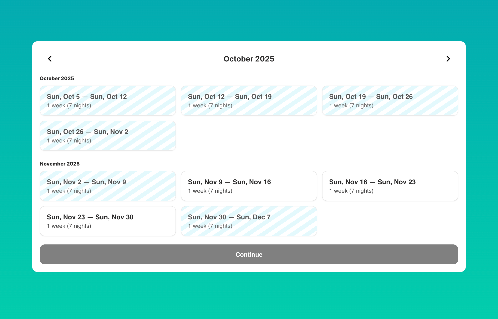

# Booking Widget - Villa Rentals

Online booking widget for villa and vacation rental services using Bookla API. This component provides a flexible calendar-based booking system that allows users to select check-in/check-out dates with configurable duration rules (weeks or days), view pricing, and complete guest information forms. It supports both week-based bookings (starting on specific weekdays) and flexible day-based bookings with customizable duration settings.

Use this component for vacation rentals, villas, apartments, or any accommodation service that requires extended stay bookings with specific duration requirements.

## Preview



## Features

- **Flexible Duration Modes**: Support for both week-based and day-based booking durations
- **Smart Calendar Selection**: Interactive calendar with availability checking and smart date selection
- **Dynamic Pricing**: Real-time price calculation based on selected dates and duration
- **Guest Information Form**: Customizable form with required and optional fields
- **Custom Form Fields**: Add additional fields with multiple input types (text, textarea, number, select, multiselect, phone, url)
- **Terms & Conditions**: Optional terms acceptance checkbox with customizable link
- **Responsive Design**: Fully responsive layout that adapts to mobile, tablet, and desktop screens
- **Modal Options**: Choose between contained or fullscreen modal presentation
- **Localization Support**: Comprehensive text customization for multi-language support
- **Visual Customization**: Extensive styling options including colors, borders, shadows, and stripe patterns

## Installation

### 1. Copy the component file

- **Component:** [`component.ts`](./component.ts)

### 2. Add to your Framer project
- Open your Framer project
- Create a new Component named `VillaBookingWidget.tsx`
- Paste the copied code into `VillaBookingWidget.tsx`
- Drag the `VillaBookingWidget` component onto your canvas

### 3. Connect with Bookla API
- Sign up at [Bookla.com](https://bookla.com) to get your API key and company ID
- Create a new service in Bookla (suitable for accommodation/villa rentals)
- Add a resource (property/villa) to this service
- Configure availability schedules for your resource
- In the Framer properties panel, set your:
  - `bkla.apiRegion` to either `'us'` or `'eu'` based on your platform location
  - `bkla.apiKey` and `bkla.companyID` to connect the component with your Bookla account
- Set the `serviceID` to the ID of the service you created
- Set the `resourceID` to the ID of the specific resource (villa/property) you want to book
- Configure duration settings based on your booking requirements (weeks or days mode)

## Properties

This component provides extensive customization options through Framer's property controls. All properties are optional unless marked as required.

### Core Configuration

| Property | Type | Default | Description |
|----------|------|---------|-------------|
| `size` | `Enum` | `'md'` | Component size: Small, Medium, or Large |
| `backgroundColor` | `Color` | `'white'` | Main background color |
| `primaryColor` | `Color` | `'black'` | Primary text and accent color |
| `secondaryColor` | `Color` | `'#666'` | Secondary text color |
| `fontFamily` | `String` | `'Inter'` | Font family for all text |
| `locale` | `String` | `'en'` | Locale for date/time formatting (e.g., 'en', 'es', 'fr', 'de') |

### Calendar Display Configuration

| Property | Type | Default | Description |
|----------|------|---------|-------------|
| `calendar.visibleMonths` | `Number` | `3` | Number of months to display in calendar view (1-6) |
| `calendar.weeksPerRow` | `Number` | `3` | Number of weeks to display per row in calendar grid (1-6) |

### Duration Mode Configuration

**Critical**: Choose between week-based or day-based booking duration

| Property | Type | Default | Description |
|----------|------|---------|-------------|
| `durationMode` | `Enum` | `'weeks'` | Duration selection mode: 'weeks' or 'days' |

#### Week Mode Settings

*Only visible when `durationMode` is 'weeks'*

| Property | Type | Default | Description |
|----------|------|---------|-------------|
| `weeks.startWeekday` | `Enum` | `'sunday'` | Required check-in weekday (sunday-saturday) |
| `weeks.hintText` | `String` | `'1 week (7 nights)'` | Helper text displayed on calendar cards |

#### Day Mode Settings

*Only visible when `durationMode` is 'days'*

| Property | Type | Default | Description |
|----------|------|---------|-------------|
| `days.startRule` | `Enum` | `'any'` | Check-in day rule: 'any' or specific weekday (sunday-saturday) |
| `days.baseLength` | `Number` | `7` | Base duration length in days (1-90) |
| `days.maxTotal` | `Number` | `28` | Maximum total duration allowed in days (1-365) |
| `days.fixedLength` | `Number` | `0` | Fixed duration in days (0 = flexible, >0 = fixed length only) |
| `days.hintText` | `String` | `'Click to select {days}-day period'` | Helper text (use {days} placeholder for dynamic length) |

### Design Customization

| Property | Type | Default | Description |
|----------|------|---------|-------------|
| `design.gridGap` | `Number` | `12` | Spacing between calendar cards in pixels (0-48) |
| `design.cardRadius` | `Number` | `12` | Border radius for calendar cards in pixels (0-32) |
| `design.cardPadding` | `Number` | `14` | Internal padding for calendar cards in pixels (4-32) |
| `design.cardBorderColor` | `Color` | `'#e5e5e5'` | Border color for calendar cards |
| `design.cardBorderWidth` | `Number` | `1` | Border width for calendar cards in pixels (0-8) |
| `design.cardShadow` | `Boolean` | `true` | Enable drop shadow on calendar cards |

### Stripe Pattern Styling

*Visual pattern overlay on calendar cards*

| Property | Type | Default | Description |
|----------|------|---------|-------------|
| `design.stripeEnabled` | `Boolean` | `true` | Enable diagonal stripe pattern on cards |
| `design.stripeColorA` | `Color` | `'rgba(0,0,0,0.06)'` | First stripe color |
| `design.stripeColorB` | `Color` | `'rgba(255,255,255,0.06)'` | Second stripe color |
| `design.stripeAngle` | `Number` | `135` | Angle of stripe pattern in degrees (0-360) |
| `design.stripeSize` | `Number` | `8` | Size of stripe pattern in pixels (4-32) |
| `design.stripeOpacity` | `Number` | `0.9` | Opacity of stripe pattern (0-1) |

### Button Styling

| Property | Type | Default | Description |
|----------|------|---------|-------------|
| `design.pillRadius` | `Number` | `999` | Border radius for pill-shaped elements in pixels (0-999) |
| `design.buttonRadius` | `Number` | `12` | Border radius for action buttons in pixels (0-32) |
| `design.buttonPaddingV` | `Number` | `14` | Vertical padding for buttons in pixels (8-32) |

### Form Configuration

| Property | Type | Default | Description |
|----------|------|---------|-------------|
| `formTexts.title` | `String` | `'Guest details'` | Guest information form title |
| `formTexts.subtitle` | `String` | `'Please fill in your details'` | Guest information form subtitle |
| `formTexts.firstNameLabel` | `String` | `'First name'` | First name field label |
| `formTexts.lastNameLabel` | `String` | `'Last name'` | Last name field label |
| `formTexts.emailLabel` | `String` | `'Email'` | Email field label |
| `formTexts.firstNameRequired` | `Boolean` | `true` | Whether first name is required |
| `formTexts.lastNameRequired` | `Boolean` | `false` | Whether last name is required |
| `formTexts.emailRequired` | `Boolean` | `true` | Whether email is required |
| `formTexts.continueLabel` | `String` | `'Continue'` | Text for continue button |
| `formTexts.bookNowLabel` | `String` | `'Book now'` | Text for final booking button |

### Custom Form Configuration

| Property | Type | Default | Description |
|----------|------|---------|-------------|
| `customForm.formTitle` | `String` | `'Additional information'` | Custom form section title |
| `customForm.formSubtitle` | `String` | `'Please fill out extra fields if needed'` | Custom form section subtitle |
| `customForm.fields` | `Array` | `[]` | Array of custom form fields |

### Custom Form Field Properties

Each field in `customForm.fields` supports:

| Property | Type | Default | Description |
|----------|------|---------|-------------|
| `labelText` | `String` | `''` | Field label text |
| `type` | `Enum` | `'text'` | Field type: text, textarea, number, select, multiselect, phone, url |
| `placeholderText` | `String` | `''` | Field placeholder text |
| `options` | `String` | `''` | Comma-separated options for select/multiselect fields |

### Terms and Conditions

| Property | Type | Default | Description |
|----------|------|---------|-------------|
| `showTerms` | `Boolean` | `false` | Show terms acceptance checkbox |

### Terms Configuration

*Only visible when `showTerms` is enabled*

| Property | Type | Default | Description |
|----------|------|---------|-------------|
| `terms.text` | `String` | `'I accept the'` | Text before the terms link |
| `terms.highlightedText` | `String` | `'terms and conditions'` | Clickable link text |
| `terms.termsLink` | `String` | `'https://example.com/terms'` | URL for terms page |

### Modal Configuration

| Property | Type | Default | Description |
|----------|------|---------|-------------|
| `modalMode` | `Enum` | `'contained'` | Modal presentation: 'contained' (within component) or 'fullscreen' |

### UI Text Customization

All interface text is customizable for localization:

#### Navigation Texts

| Property | Type | Default | Description |
|----------|------|---------|-------------|
| `texts.previousMonth` | `String` | `'Previous month'` | Previous month button label |
| `texts.nextMonth` | `String` | `'Next month'` | Next month button label |
| `texts.close` | `String` | `'Close'` | Close button label |

#### Instruction Texts

| Property | Type | Default | Description |
|----------|------|---------|-------------|
| `texts.daysStartDayAnyInstruction` | `String` | `'Start day can be any. Choose length below.'` | Instruction when any start day is allowed |
| `texts.daysStartDayFixedInstruction` | `String` | `'Start day must be {weekday}. Choose length below.'` | Instruction for fixed start day ({weekday} is replaced) |

#### Selection Display Texts

| Property | Type | Default | Description |
|----------|------|---------|-------------|
| `texts.checkIn` | `String` | `'Check-in'` | Check-in date label |
| `texts.checkOut` | `String` | `'Check-out'` | Check-out date label |
| `texts.day` | `String` | `'day'` | Singular form for duration |
| `texts.days` | `String` | `'days'` | Plural form for duration |

#### Price Texts

| Property | Type | Default | Description |
|----------|------|---------|-------------|
| `texts.fetchingPrice` | `String` | `'Fetching price…'` | Loading message while fetching price |
| `texts.priceLabel` | `String` | `'Price for selected period:'` | Price display label |

#### Success Texts

| Property | Type | Default | Description |
|----------|------|---------|-------------|
| `texts.bookingRequestedTitle` | `String` | `'Booking requested'` | Success screen title |
| `texts.bookingRequestedMessage` | `String` | `'We've received your request. You'll get a confirmation or payment step next.'` | Success screen message |

#### Error Messages

| Property | Type | Default | Description |
|----------|------|---------|-------------|
| `texts.missingConfig` | `String` | `'Missing Bookla config (API key / company / service / resource).'` | Configuration error message |
| `texts.availabilityError` | `String` | `'Failed to load availability.'` | Availability loading error |
| `texts.firstNameRequired` | `String` | `'Please enter your first name.'` | First name validation error |
| `texts.lastNameRequired` | `String` | `'Please enter your last name.'` | Last name validation error |
| `texts.emailRequired` | `String` | `'Please enter your email.'` | Email validation error |
| `texts.noSlotFound` | `String` | `'No available slot found for the selected dates.'` | No availability error |
| `texts.bookingFailed` | `String` | `'Booking failed. Please try a different date or contact support.'` | Booking failure error |

### API Configuration

**Required properties for the component to function**

| Property | Type | Default | Description |
|----------|------|---------|-------------|
| `bkla.apiRegion` | `Enum` | `'eu'` | API region: 'us' (U.S.) or 'eu' (Europe) |
| `bkla.apiKey` | `String` | `''` | **Required**: Bookla API key |
| `bkla.companyID` | `String` | `''` | **Required**: Company ID from Bookla |
| `serviceID` | `String` | `''` | **Required**: Service ID to load availability from |
| `resourceID` | `String` | `''` | **Required**: Resource ID (specific villa/property) |

### Route Configuration

| Property | Type | Default | Description |
|----------|------|---------|-------------|
| `routes.confirmed` | `Link` | `'/'` | Route to navigate after confirmed booking |
| `routes.pending` | `Link` | `'/'` | Route to navigate for pending bookings |

## Usage Examples

### Basic Villa Booking (Week Mode)

```typescript
<VillaBookingWidget
  bkla={{
    apiRegion: "eu",
    apiKey: "your-api-key",
    companyID: "your-company-id"
  }}
  serviceID="service-123"
  resourceID="villa-456"
  durationMode="weeks"
  weeks={{
    startWeekday: "saturday",
    hintText: "1 week (7 nights)"
  }}
/>
```

### Flexible Day-Based Booking

```typescript
<VillaBookingWidget
  bkla={{
    apiRegion: "us",
    apiKey: "your-api-key",
    companyID: "your-company-id"
  }}
  serviceID="service-123"
  resourceID="apartment-789"
  durationMode="days"
  days={{
    startRule: "any",
    baseLength: 3,
    maxTotal: 14,
    fixedLength: 0,
    hintText: "Click to select {days}-day period"
  }}
/>
```

### With Custom Styling and Terms

```typescript
<VillaBookingWidget
  bkla={{
    apiRegion: "eu",
    apiKey: "your-api-key",
    companyID: "your-company-id"
  }}
  serviceID="service-123"
  resourceID="villa-456"
  primaryColor="#2563eb"
  backgroundColor="#f9fafb"
  design={{
    cardRadius: 16,
    buttonRadius: 8,
    stripeEnabled: true,
    cardShadow: true
  }}
  showTerms={true}
  terms={{
    text: "I agree to the",
    highlightedText: "terms and conditions",
    termsLink: "https://mysite.com/terms"
  }}
/>
```

### With Custom Form Fields

```typescript
<VillaBookingWidget
  bkla={{
    apiRegion: "eu",
    apiKey: "your-api-key",
    companyID: "your-company-id"
  }}
  serviceID="service-123"
  resourceID="villa-456"
  customForm={{
    formTitle: "Additional information",
    formSubtitle: "Please provide extra details",
    fields: [
      {
        labelText: "Number of guests",
        type: "number",
        placeholderText: "Enter number of guests"
      },
      {
        labelText: "Special requests",
        type: "textarea",
        placeholderText: "Any special requirements?"
      },
      {
        labelText: "Meal preference",
        type: "select",
        options: "Vegetarian,Vegan,No preference"
      }
    ]
  }}
/>
```

## Duration Modes Explained

### Week Mode

Best for properties with fixed weekly bookings (common for vacation rentals):
- Users can only select full weeks starting on a specified weekday (e.g., Saturday to Saturday)
- Supports multi-week selections by clicking consecutive weeks
- Check-in day is always the configured weekday
- Ideal for traditional villa rentals with weekly turnover

### Day Mode

Flexible booking durations for properties with varied stay lengths:
- **Start Rule**: Choose between 'any' day or a specific weekday for check-ins
- **Base Length**: Default duration suggestion (e.g., 3 days)
- **Max Total**: Maximum allowed duration (prevents overly long bookings)
- **Fixed Length**: Set to 0 for flexible durations, or specify a fixed duration only (e.g., 7 for week-only bookings)
- Users select a start date, then choose their duration
- Perfect for city apartments, short-term rentals, or flexible booking scenarios

## Responsive Behavior

The component automatically adapts to different screen sizes:

- **Mobile (< 640px)**: Single column layout, stacked calendar weeks, simplified navigation
- **Tablet (640px - 1024px)**: Two-column layout where appropriate, optimized touch targets
- **Desktop (> 1024px)**: Full multi-column calendar grid, hover states, expanded views

## Styling Tips

### Theme Integration

The component uses your configured colors throughout:
- `primaryColor`: Selected dates, active states, primary text
- `secondaryColor`: Disabled dates, secondary text, borders
- `backgroundColor`: Card backgrounds, modal backgrounds

### Stripe Patterns

The diagonal stripe pattern adds visual interest to available periods:
- Enable/disable with `design.stripeEnabled`
- Adjust angle for different visual effects (45° or 135° work well)
- Use subtle colors for professional look or bold colors for playful design

### Button Styling

Two radius controls provide flexibility:
- `design.pillRadius`: For pill-shaped elements (set to 999 for fully rounded)
- `design.buttonRadius`: For action buttons (lower values for modern, squared look)

## Bookla Integration

### Service Setup

1. In your Bookla dashboard, create a service for accommodation
2. Set appropriate pricing rules (per night, per week, etc.)
3. Configure availability calendar with blocked dates
4. Add resources (individual properties/villas) to the service

### Resource Configuration

Each resource represents a specific property:
- Set capacity, amenities, and descriptions in Bookla
- Configure pricing variations by season
- Manage availability calendar per property
- Handle overbooking prevention automatically

### Booking Flow

1. User selects dates in the component calendar
2. Component queries Bookla API for availability and pricing
3. Real-time price calculation displayed
4. User fills guest information form
5. Booking request sent to Bookla
6. User redirected based on booking status (confirmed/pending)

## Localization

The component supports full localization through the `texts` configuration object. All user-facing text can be customized:

```typescript
<VillaBookingWidget
  locale="es"
  texts={{
    checkIn: "Entrada",
    checkOut: "Salida",
    days: "días",
    fetchingPrice: "Obteniendo precio…",
    // ... all other text properties
  }}
  formTexts={{
    title: "Datos del huésped",
    firstNameLabel: "Nombre",
    // ... all other form text properties
  }}
/>
```

## Troubleshooting

### Calendar Not Loading
- Verify `apiKey`, `companyID`, `serviceID`, and `resourceID` are correct
- Check that the API region matches your Bookla account location
- Ensure the service and resource exist in your Bookla dashboard

### No Available Dates Showing
- Check that availability is configured in Bookla for the service
- Verify `calendar.visibleMonths` covers the period with availability
- Ensure the resource is not completely blocked in Bookla calendar

### Booking Fails
- Verify guest form is properly filled with valid email format
- Check that selected dates are still available (not double-booked)
- Ensure terms are accepted if `showTerms` is enabled
- Review Bookla dashboard for booking rules or restrictions

### Pricing Not Displaying
- Confirm pricing is configured in Bookla for the service
- Check that the date range has valid pricing rules
- Verify API connection and credentials

## Browser Support

- Chrome/Edge (latest)
- Firefox (latest)
- Safari (latest)
- Mobile browsers (iOS Safari, Chrome Mobile)

## Dependencies

- React 18+
- Framer Motion
- Bookla React Client SDK (@bookla-app/react-client-sdk@0.3.15)
- Lucide React (for icons)

## License

This component is provided as-is for use with Bookla services. Please refer to Bookla's terms of service for API usage.

## Support

For issues related to:
- **Component functionality**: Create an issue in this repository

## Credits

Created for use with [Bookla](https://bookla.com) booking platform.